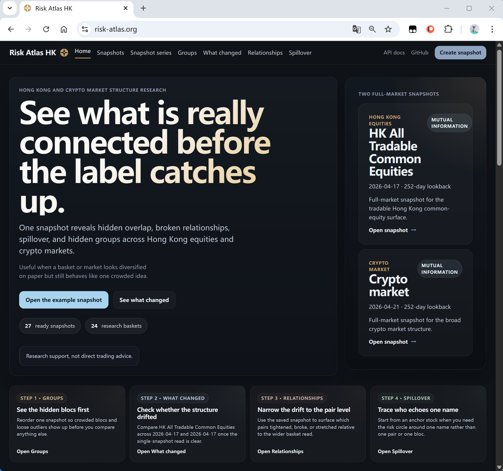
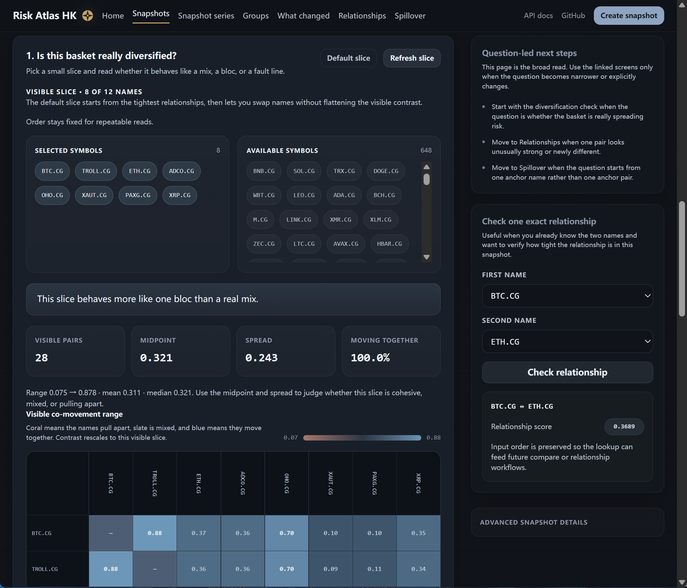

# Risk Atlas

English version: [README.md](README.md) | 簡體中文版本：[README.zh-CN.md](README.zh-CN.md)

Risk Atlas 是一個面向港股及加密市場的市場結構研究產品。它把日頻價格資料構建成離線關係矩陣，再圍繞這些工件提供快照、快照序列、結構漂移對比、關係檢查、spillover 分析及隱藏分組等工作流程。

目前公開 UI 的品牌文案仍然是 “Risk Atlas HK”，但實際產品能力已覆蓋港股及加密市場。

## 線上示例

你可以直接瀏覽線上部署示例：<https://risk-atlas.org>

- 這是目前已部署並實際運行的版本，也是最快看到真實介面的方式。
- 如果你想先看成品，再決定是否在本機啟動或部署到自己的伺服器，這個站點是最直接的參考入口。
- 倉庫程式碼可能會繼續演進，但這個網址仍然是目前最直觀的在線示例。

## 運行截圖

### 首頁



### 快照詳情頁



## 這個產品適合誰

- 想看「市場結構」及「聯動關係」，而不只是看單一價格走勢的研究用戶。
- 想比較分散度、擁擠度、漂移及隱藏分組變化的團隊或個人。
- 想參考一套「離線構建 artifact + 在線讀取」真實落地方案的開發者。

## 目前用戶已經可以做什麼

- 瀏覽港股及加密市場的已保存快照。
- 打開由 `matrix.bsm`、`preview.json` 及 `manifest.json` 支撐的快照詳情頁。
- 在不同日期、不同窗口、不同 Universe 之間做快照對比。
- 查看關係結構、pair drift、spillover 及 grouped structure 相關讀取結果。
- 透過邀請碼控制 build / build series / analysis run 的建立及排入佇列，同時保持唯讀路徑開放。
- 在本機檔案系統及 S3 兩種 artifact 後端之間切換。

## 最新驗證狀態

以下狀態已於 2026-04-23 在本機驗證通過：

- `pnpm bootstrap:local` 全流程成功，退出碼為 0。
- bootstrap 重用了倉庫內的 `data/real-hk` 及 `data/crypto` 基線資料，並把兩個市場都 overlap-refresh 到 2026-04-23。
- 預設的 8 個全市場快照全部成功完成，窗口均為 `252`，覆蓋港股 4 個 score method 及加密 4 個 score method。
- 港股最新快照共解析 2471 個 symbol。
- 加密最新快照共解析 654 個 symbol。
- 港股目錄目前共有 1,408,608 行 EOD 資料；加密目錄目前共有 248,371 行 EOD 資料。
- 首輪 build_run 已開始穩定寫入 `sourceDatasetMaxTradeDate`、`symbolSetHash` 及 `symbolStateHashesJson`。
- 手動以相同配置重跑最新港股 `pearson_corr` 後，成功重用 2471 行 parent prefix，並以 `buildStrategy=incremental` 完成。

## 目前預設資料面

- 港股主資料集：`hk_eod_yahoo_real_v1`。
- 港股預設全市場 Universe：`hk_all_common_equity`。
- 加密主資料集：`crypto_market_map_yahoo_v2`。
- 加密預設全市場 Universe：`crypto_market_map_all`。
- 額外的加密 Universe 包括市值分層 Universe 及流動性驅動 Universe，例如 `crypto_top_50_liquid`、`crypto_top_100_liquid`、`crypto_top_200_liquid`。
- 預設 bootstrap 會產出 8 個最新全市場快照：港股 4 個 score method，加密 4 個 score method，全部使用 `windowDays=252`。

## 構建面與產品工作流程

### 支援的構建輸入

- 市場：HK、CRYPTO。
- Score methods：`pearson_corr`、`ewma_corr`、`tail_dep_05`、`nmi_hist_10`。
- 窗口：`60`、`120`、`252`。
- Build Series 頻率：`daily`、`weekly`、`monthly`。
- Artifact backend：`local_fs`、`s3`。
- 目前單次構建上限：4000 個 resolved symbols。

### 主要工作流程

- Snapshot 列表與詳情頁。
- Snapshot series 排程與歷史回放。
- Compare Builds：按時間、窗口、Universe 對比。
- 關係查詢與 pair 級別檢查。
- 由單一 anchor symbol 向外看的 spillover 分析。
- 隱藏分組及 clustered structure 視圖。

### 存取模型

- 建立 build run 需要邀請碼。
- 建立 build series 需要邀請碼。
- 把新的 analysis run 排入佇列需要邀請碼。
- 現有 build、analysis run、compare 結果及唯讀查詢介面對外開放。

## 系統如何運作

1. 把 EOD 資料導入 PostgreSQL，並更新 dataset 中繼資料。
2. 按請求的日期及窗口解析 Universe。
3. 準備收益率輸入，再交給 C++ 矩陣構建器。
4. 持久化標準 artifact bundle：`matrix.bsm`、`preview.json`、`manifest.json`。
5. API 及前端基於資料庫中繼資料與 artifact 查詢結果提供讀取能力。

## Artifact bundle 是什麼

- `matrix.bsm` 是矩陣類讀取的數值真源。
- `preview.json` 保存 symbol 順序、top pairs 及輕量摘要欄位，方便前端快速讀取。
- `manifest.json` 保存 bundle 中繼資料、位元組大小、邊界值及 preview 格式資訊。

目前 C++ incremental builder 同時支援兩種增量能力：

- 同一個 build-run 中斷後的斷點續跑。
- 跨 build-run 的 parent prefix 重用。

只要 symbol 順序及逐 symbol 狀態雜湊仍然匹配，新的構建就可以直接重用父構建的前綴矩陣，而不是由頭完整重算。

## 本機啟動

### 前置要求

- Node.js 20+。
- pnpm 10+。
- Docker 與 Compose。
- CMake 3.20+。
- 支援 C++20 的編譯器。

### 由空倉庫到本機運行的最快路徑

```bash
git clone <your-repo-url>
cd risk-atlas
cp .env.example .env
pnpm quickstart
```

`pnpm quickstart` 會自動完成：

- 安裝 monorepo 依賴。
- 把根目錄 `.env` 同步到 `apps/api/.env` 及 `apps/web/.env`。
- 透過 Docker Compose 啟動 PostgreSQL。
- 配置並編譯 C++ 目標。
- 執行 Prisma generate 及 migrations。
- 運行市場狀態 bootstrap。
- 啟動 API 與 Web 開發伺服器。

預設本機地址：

- Web: http://localhost:5173。
- API: http://localhost:3000。
- Swagger UI: http://localhost:3000/docs。

如果你想把初始化及日常開發啟動分開執行：

```bash
pnpm bootstrap:local
pnpm dev:stack
```

## Bootstrap 預設會產出什麼

`pnpm bootstrap:local` 現在預設走 `RISK_ATLAS_BOOTSTRAP_MARKET_STATE=1` 的市場狀態 bootstrap 路徑。

這條路徑會：

- 優先重用倉庫中已存在的 `data/real-hk` 及 `data/crypto` 基線資料。
- 只在必要時補齊港股 prerequisite。
- 對港股及加密都執行 overlap refresh，而不是每次由零重建。
- 按 `windowDays=252` 構建或重用最新 8 個全市場快照。
- 令你在 bootstrap 完成後就擁有可直接查詢的最新 artifact bundle。

同一套刷新邏輯亦用於每日任務：

```bash
pnpm --dir apps/api db:refresh-daily-market-state
```

AWS 部署文件內已包含每 24 小時執行一次的 systemd timer 配置。

## 常用命令

```bash
pnpm env:sync
pnpm bootstrap:local
pnpm dev:stack
pnpm real-hk:refresh
pnpm real-hk:taxonomy
pnpm crypto:market-map:import
pnpm crypto:coinbase:import
pnpm --dir apps/api db:refresh-daily-market-state
```

命令說明：

- `pnpm env:sync`：把根目錄 env 配置同步到前後端應用目錄。
- `pnpm bootstrap:local`：準備本機資料庫、資料集、artifact 及預設快照。
- `pnpm dev:stack`：啟動本機 API 與 Web 開發服務。
- `pnpm real-hk:refresh`：刷新真實港股資料與 coverage 審計報告。
- `pnpm real-hk:taxonomy`：只刷新港股 taxonomy 覆蓋。
- `pnpm crypto:market-map:import`：導入較大的加密 market-map 資料集。
- `pnpm crypto:coinbase:import`：導入較小的 Coinbase POC 加密資料集。
- `pnpm --dir apps/api db:refresh-daily-market-state`：手動執行每日刷新任務。

## 關鍵配置項

在 bootstrap 或部署之前，先編輯根目錄 `.env`。最關鍵的變數包括：

- `POSTGRES_DB`、`POSTGRES_USER`、`POSTGRES_PASSWORD`、`POSTGRES_HOST`、`POSTGRES_PORT`。
- `API_PORT`、`WEB_PORT`。
- `VITE_API_BASE_URL`、`CORS_ALLOWED_ORIGINS`。
- `ARTIFACT_STORAGE_BACKEND`、`ARTIFACT_ROOT_DIR`、`ARTIFACT_CACHE_DIR`。
- `AWS_REGION`、`S3_ARTIFACT_BUCKET`、`S3_ARTIFACT_PREFIX`、`S3_SIGNED_URL_TTL_SECONDS`。
- `RISK_ATLAS_INVITE_CODES`、`RISK_ATLAS_INVITE_SALT`。
- `RISK_ATLAS_BOOTSTRAP_MARKET_STATE`。
- `RISK_ATLAS_BOOTSTRAP_REAL_HK`。

Artifact backend 行為：

- `local_fs`：artifact bundle 保存在本機目錄。
- `s3`：artifact 上傳到 S3，同時保留本機 matrix 快取以兼容現有 C++ 查詢鏈路。

修改根目錄 env 之後，執行：

```bash
pnpm env:sync
```

## 資料管線

### 港股真實市場管線

- 倉庫內已經有 `data/real-hk` 基線時會優先直接重用。
- 可透過 `pnpm real-hk:refresh` 從上游刷新資料並重寫 benchmark 報告。
- 會維護 `security_master` 中的 taxonomy overlay，以支援 sector-aware 讀取。

### 加密 market-map 管線

- 先用 CoinGecko market metadata 做候選排序。
- 再用 Yahoo chart history 批量拉取實際日頻價格。
- 預設以 best-effort 模式運行，只要幸存資產數高於最小門檻就繼續構建。
- 輸出 CSV、symbols 與 taxonomy 檔案到 `data/crypto`。

較大的 market-map 導入器會建立：

- dataset：`crypto_market_map_yahoo_v2`。
- static universes：`crypto_market_map_all`、`crypto_market_cap_50`、`crypto_market_cap_100`、`crypto_market_cap_200`。
- dynamic universes：例如 `crypto_top_50_liquid`、`crypto_top_100_liquid`、`crypto_top_200_liquid` 及已填充的 sector basket。

## AWS 部署

目前推薦的生產形態是：

- 一台 Ubuntu EC2。
- 主機層 Nginx 暴露 80 / 443。
- Docker Compose 運行 API 與 PostgreSQL。
- 一個對外域名，走 same-origin 路由。
- 可選的 S3 artifact 儲存與本機 matrix 快取。
- 每 24 小時自動刷新的 systemd timer。

完整的生產部署說明、環境變數範本、Compose 檔案、Nginx 配置及 S3 說明見 [aws/README.zh-HK.md](aws/README.zh-HK.md)。

## 研究邊界

Risk Atlas 是研究輔助工具，不是直接的交易建議系統。

- 它描述的是聯動與結構，不是因果解釋。
- 它可以暴露集中度、漂移、spillover 及 clustering，但不保證這些關係持續存在。
- 它是基於 EOD 與離線 artifact 的研究系統，不是即時風控或執行引擎。