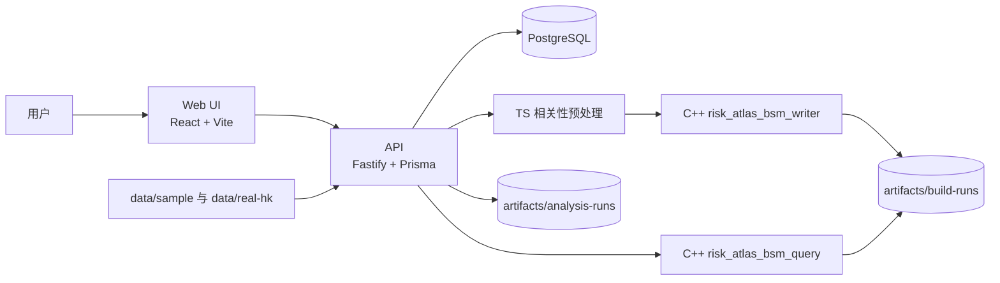

# Risk Atlas 项目架构与功能全分析

## 0. 文档目的与分析范围

本文基于当前仓库中的代码、脚本、Prisma 模型、前端页面路由、后端服务实现、C++ 工具、README 和 [MVP_SCOPE.md](./MVP_SCOPE.md) 完成，时间点为 2026-04-20。

这份分析重点回答 4 个问题：

- 这个项目的架构到底是什么。
- 从一个用户视角，我到底能做什么。
- 它背后的工作原理是什么。
- 这个产品对我有没有用，适合什么人，不适合什么人。

一句话先下结论：

Risk Atlas 不是一个“直接给买卖建议”的交易系统，而是一个以港股为核心的市场关系研究平台。它先把一个股票篮子在某个日期、某个回看窗口内的共振关系离线算成可复用的矩阵产物，再围绕这个产物提供浏览、对比、关系漂移、单名外溢、隐藏分组等研究工作流。

## 1. 这个项目的本质是什么

从代码结构和产品文案看，Risk Atlas 的核心设计不是“做一个普通行情网站”，而是做一个：

- 以快照为中心的研究工作台。
- 以离线矩阵产物为中心的查询系统。
- 以“用户问题”而不是“技术指标列表”为中心的产品界面。

它想解决的不是“下一笔买什么”，而是下面这些更像研究问题的事情：

- 我以为自己分散了，但这些股票其实是不是还在一起动。
- 哪些股票关系已经变了，旧经验可能不再可靠。
- 如果一个名字开始掉，通常谁会跟着动。
- 这个篮子里有没有隐藏的群组，表面分散、实际拥挤。
- 同一个篮子在不同日期、不同窗口、不同篮子定义下，结构到底怎么变。

换句话说，它是一个“市场结构透视层”，不是一个“交易建议层”。

## 2. 总体架构：这是一个三层系统

这个项目最准确的描述不是简单的“前后端分离”，而是三层结构：

1. 体验层：React Web 界面，负责把研究问题变成页面工作流。
2. 控制层：Fastify API + Prisma + PostgreSQL，负责元数据、验证、调度和权限门控。
3. 产物层：本地 artifacts + C++ BSM 工具，负责存和查真正的关系矩阵。

这三层组合在一起，形成一个很清晰的 build-centric、artifact-centric 架构。

### 2.1 架构示意图

### 2.2 为什么这个架构值得注意

这个项目没有把所有分析都塞进数据库里，也没有把所有关系都放成前端临时计算，而是做了一个明确分工：

- PostgreSQL 负责“记录这次构建是什么、状态如何、属于哪个数据集和篮子”。
- 矩阵本体放在文件产物里，而不是数据库表里。
- 真正的矩阵读写由 C++ 工具完成，而不是让 Node.js 直接处理大矩阵二进制。
- 前端围绕一个已经存在的“快照对象”做多种研究动作，而不是每个页面各算各的。

这说明它的主域模型不是“股票列表”，而是“研究快照”。

## 3. Monorepo 分层与各目录职责

### 3.1 顶层目录作用

| 目录 | 角色 | 说明 |
| --- | --- | --- |
| `apps/api` | 后端控制层 | Fastify API、Prisma、构建调度、分析逻辑、邀请门控 |
| `apps/web` | 前端体验层 | React 页面、研究工作流、结果展示 |
| `cpp` | 产物引擎 | BSM 二进制矩阵的写入与查询工具 |
| `artifacts` | 运行结果落盘 | 构建产物、分析结果、基准报告 |
| `data` | 数据输入源 | 示例数据和真实港股数据 |
| `docs` | 项目文档 | 范围说明、分析文档 |
| `infra` | 本地基础设施 | Docker Compose，当前主要是 PostgreSQL |
| `scripts` | 启动与维护脚本 | quickstart、bootstrap、dev-stack、env sync、real hk refresh |

### 3.2 启动与开发脚本体现的运维形态

从脚本看，项目默认定位是“本地一键可起”的研发环境：

- `pnpm quickstart`：安装依赖、bootstrap、再启动前后端。
- `scripts/bootstrap-local.sh`：检查 `pnpm`、`docker`、`cmake`，启动 PostgreSQL，构建 C++，做 Prisma generate、migrate、seed。
- `scripts/dev-stack.sh`：并行启动 `apps/api` 和 `apps/web`。

这意味着这个仓库并不是只有应用代码，而是已经把：

- 本地数据库
- 本地 C++ 工具链
- 示例数据初始化
- 前后端协同运行

这些都纳入了同一个开发闭环。

## 4. 核心领域模型：系统到底围绕什么对象运转

当前项目最重要的不是 UI 页面，而是后端的数据对象。它们定义了整个产品的思维方式。

### 4.1 Prisma 里的核心实体

| 实体 | 存储位置 | 作用 |
| --- | --- | --- |
| `SecurityMaster` | PostgreSQL | 证券主数据，包含 symbol、名称、证券类型、行业、市场 |
| `Dataset` | PostgreSQL | 一个价格数据集的定义和覆盖范围 |
| `EodPrice` | PostgreSQL | 每个 symbol 的日频收盘数据 |
| `Universe` | PostgreSQL | 用户分析的股票篮子定义 |
| `BuildRun` | PostgreSQL | 一次快照构建任务，是最核心的业务对象 |
| `Artifact` | PostgreSQL + 文件系统 | 记录该 BuildRun 对应的矩阵产物元数据 |
| `BuildSeries` | PostgreSQL | 一组按频率自动展开的 BuildRun 序列 |
| `InviteCode` | PostgreSQL | 对创建与分析动作做轻量权限门控 |
| `AnalysisRun` | 文件系统 JSON | 针对某个 BuildRun 的持久化分析结果 |

### 4.2 这个模型说明了什么

这套模型表明，Risk Atlas 的业务中心不是“用户账户”，也不是“组合管理”，而是：

- 数据集
- 股票篮子
- 快照构建
- 快照衍生分析

也就是说，它更像一个研究生产线，而不是一个传统 SaaS 账户系统。

### 4.3 最关键的对象：BuildRun

`BuildRun` 是整个产品的核心主对象。

一个 BuildRun 本质上回答的是：

> 在某个数据集里，对某个股票篮子，在某个 as-of date，用某个 lookback window，算出来的市场关系快照是什么？

这个对象一旦成功，会关联 3 个关键产物：

- `matrix.bsm`：真正的关系矩阵二进制文件。
- `preview.json`：前端可快速读取的摘要、symbol 顺序、top pairs、structure summary。
- `manifest.json`：产物元数据和字节级描述。

这也是为什么整个产品看起来像是“先 build，再 query”。

## 5. 数据与计算链路：系统是怎么从价格数据走到可读结果的

这一段是整个项目最重要的部分。

### 5.1 第一步：选定研究对象

用户或者系统先确定 4 个条件：

- 数据集 `datasetId`
- 股票篮子 `universeId`
- 截止日期 `asOfDate`
- 回看窗口 `windowDays`

当前代码中，窗口是固定集合：

- 60
- 120
- 252

评分方法当前固定为：

- `pearson_corr`

所以这不是一个任意参数平台，而是一个刻意收窄、强调稳定性的 MVP。

### 5.2 第二步：解析 Universe

Universe 不是只有固定列表，它支持 4 种定义方式：

1. `static`
2. `liquidity_top_n`
3. `sector_filter`
4. `all_common_equity`

这非常关键，因为它决定了用户不是只能看手工名单，还可以看：

- 流动性前 N 的市场面
- 某一行业切片
- 整个港股普通股可交易面

对应逻辑大致是：

- `static`：直接用预设 symbol 列表。
- `all_common_equity`：取截至某日、满足最少历史行数、且在 `SecurityMaster` 中属于普通股的全部标的。
- `sector_filter`：先找满足覆盖要求的普通股，再按 sector 筛掉。
- `liquidity_top_n`：在最近若干交易日上按平均成交量排序，取前 N。

### 5.3 第三步：验证请求是不是“真的可建”

这个项目有一个非常重要、也非常专业的区别：

- `coverage-qualified symbols`
- `matrix-ready symbols`

这两个不是同一个概念。

#### coverage-qualified 是什么

它表示：

- 该 symbol 截至 `asOfDate` 至少有 `windowDays + 1` 条价格记录。

这是“有足够历史”的概念。

#### matrix-ready 是什么

它表示：

- 不仅历史条数够，而且在收益率预处理后，这个 symbol 仍然是可用于矩阵计算的。

例如：

- 收益序列过平、近乎零方差
- 无法形成有效 return vector

就会被过滤掉。

这也是为什么系统在验证阶段不会简单告诉你“篮子里有多少只股票”，而是更诚实地告诉你：

- 有多少只是覆盖合格
- 最后真正能进矩阵的有多少

这点非常重要，因为它避免了“用户以为在分析 100 只，实际上只算了 63 只”的误解。

### 5.4 第四步：准备收益率向量

通过 `prepareCorrelationInputs` 和相关函数，系统会：

- 读取截至 `asOfDate` 的价格序列。
- 选出用于 pairwise overlap 的市场交易日期集合。
- 对每个 symbol 构造 log return 向量。
- 用 `NaN` 代表该 symbol 在某些市场日期上没有数据。
- 过滤近零方差序列。

这里的关键不是“全市场完全对齐”，而是“pairwise overlap”。

也就是：

- 两只股票之间的相关性，只要求这两只在足够多的共同有效日期上有收益率。
- 不要求整个 universe 所有股票都必须共享完全相同的日期集合。

这是这个项目能够支持更大港股 universe 的关键设计之一。

### 5.5 第五步：计算相关矩阵

矩阵计算使用的是 Pearson correlation，但不是对全量日期做死板对齐，而是：

- 只在最近 `windowDays` 个有效重叠观测上做相关性计算。
- 要求至少满足一个最小 overlap 门槛。

当前最小 pairwise overlap 门槛为：

- 60 日窗口：至少 20 个共同观测
- 120 日窗口：至少 40 个共同观测
- 252 日窗口：至少 60 个共同观测

如果重叠不足，相关性直接按 0 处理。

这个设计非常务实：

- 它不会因为少数缺失日期直接让整次构建失败。
- 但也不会把稀疏重叠硬算成看起来很“精确”的关系。

### 5.6 第六步：把 dense matrix 写成 BSM 产物

Node 侧算出 dense score matrix 以后，不直接把它长期保存在 JS 内存或 JSON 中，而是把它交给 C++ 可执行文件 `risk_atlas_bsm_writer`。

这个工具会：

- 从 stdin 读取矩阵维度、symbol 顺序和完整的 dense score matrix。
- 校验矩阵是否对称、是否存在非法数值。
- 写入 blocked symmetric matrix 格式的 `.bsm` 文件。

这一步非常关键，因为它把“计算一次”变成了“之后可反复快速查询的只读产物”。

### 5.7 第七步：生成 preview 与 manifest

构建成功后，系统还会生成：

- `preview.json`
- `manifest.json`

`preview.json` 主要服务前端快速展示：

- symbolOrder
- topPairs
- min/max score
- structureSummary

`manifest.json` 主要服务产物描述与一致性：

- 文件名
- 文件大小
- bundle version
- 构建参数
- score 范围

这说明系统不是只做“算完即弃”的临时结果，而是把产物当成正式对象来管理。

## 6. 后端架构：控制层如何组织

### 6.1 一个很清楚的 route/service 分层

后端基本遵循：

- `routes/`：负责 HTTP 映射、schema、错误码转换。
- `services/`：负责真正的业务逻辑。
- `contracts/`：负责类型、常量、schema。
- `lib/`：负责 Prisma、错误类、通用工具。

这种分层对于这个项目是合适的，因为它的逻辑量明显已经超过“把所有代码写在路由里”的规模。

### 6.2 主要 API 模块

| 模块 | 作用 | 代表能力 |
| --- | --- | --- |
| `catalog` | 目录信息 | 数据集、篮子、security master 浏览 |
| `build-runs` | 快照核心 API | 创建 build、验证 build、查看 detail、pair score、neighbors、heatmap、exposure、divergence、structure、download |
| `build-series` | 时间序列构建 | 创建 series、查看 series 列表和详情 |
| `analysis-runs` | 持久化分析任务 | 创建 pair divergence / exposure / structure 的分析结果并可重开 |
| `compare` | 双快照对比 | 关系漂移 compare、结构漂移 compare |
| `system` | 系统状态 | `/health` |

### 6.3 权限模型不是完整鉴权，而是“计算门控”

当前项目没有完整的用户账号系统，没有角色权限系统，也没有 session/JWT。

它使用的是一种轻量但非常明确的门控方式：邀请码。

门控规则是：

- 创建 `BuildRun`：需要邀请码，放在 request body 中。
- 创建 `BuildSeries`：需要邀请码，放在 request body 中。
- 创建 `AnalysisRun`：需要邀请码，放在 `x-invite-code` 请求头中。
- 浏览已存在的 build、series、analysis result、compare 读接口：开放。

因此这个系统当前的 access model 不是“身份认证”，而是：

- 公开读
- 受控写

这非常适合研究产品的 MVP 阶段：

- 用户可以自由看结果。
- 但不会让任何人无限制触发重计算。

另外，邀请码如果配置了 `usesLeft`，每次成功通过校验会消耗次数。这说明邀请码不只是开关，也可以是带额度的计算配额门。

### 6.4 构建调度模型：当前是单进程内调度，不是外部队列

这一点非常关键。

当前 `BuildRun` 和 `AnalysisRun` 的调度都不是通过 Redis、RabbitMQ、Kafka 或独立 worker 进程完成的，而是：

- 由 API 进程内的 `setImmediate` 触发。
- 在当前 Node 进程里直接执行。

这意味着：

- 架构简单，开发成本低。
- 本地和单机部署体验很好。
- 但它本质上还是单节点、单进程的后台作业模型。

### 6.5 一个真实的边界条件：AnalysisRun 会恢复，BuildRun 当前没有显式恢复逻辑

从启动代码看，API 启动时会执行：

- `resumePendingAnalysisRuns()`

也就是说：

- `analysis-runs` 如果在 `pending` 或 `running` 状态，服务重启后会重新调度。

但当前并没有对应的 `resumePendingBuildRuns()`。

这意味着至少从现有代码实现看：

- AnalysisRun 具备重启恢复能力。
- BuildRun 更依赖于创建当时的即时调度。

这不是致命问题，但它说明系统目前更像一个“单机研究服务”，而不是“完全容错的分布式作业平台”。

## 7. 产物层架构：为什么要有 C++ 和 artifacts

### 7.1 为什么不用数据库直接存所有关系

如果把一个 N x N 的关系矩阵完全按表存储：

- 数据量会迅速膨胀。
- top-k、pair-score、submatrix、compare 这类读取会越来越重。
- 前端大量查看时会把数据库变成数值查询引擎。

这个项目没有这么做，而是采用：

- PostgreSQL 存元数据
- `.bsm` 文件存矩阵本体
- C++ 二进制负责读取和局部查询

这是一种很清楚的“控制面 / 数据面”分离。

### 7.2 BSM 文件在系统里扮演什么角色

`.bsm` 是这个项目真正的核心资产之一。

它支持后续查询能力：

- 查询任意一对 symbol 的 score
- 查询一个 symbol 的 top-k neighbors
- 提取一个小 heatmap 所需的子矩阵
- 比较两个 build 之间的 top drift pairs

也就是说，BuildRun 成功之后，后续很多页面都不需要重算全矩阵，而是在已有产物上做快速查询。

### 7.3 artifacts 的两种落盘形态

系统当前有两类持久化结果：

#### build artifacts

路径形态：

- `artifacts/build-runs/{buildRunId}/matrix.bsm`
- `artifacts/build-runs/{buildRunId}/preview.json`
- `artifacts/build-runs/{buildRunId}/manifest.json`

#### analysis artifacts

路径形态：

- `artifacts/analysis-runs/{analysisRunId}/record.json`

这意味着：

- BuildRun 是“基础产物”。
- AnalysisRun 是“围绕基础产物形成的可重开研究结果”。

这也解释了为什么某些分析页面强调“保存下来以后可以重新打开”。

## 8. 前端架构：不是普通 dashboard，而是问题驱动的研究 UI

### 8.1 前端路由全景

前端主路由有 9 个：

| 路由 | 页面职责 | 用户真实问题 |
| --- | --- | --- |
| `/` | 首页 | 这个产品适合怎么用，我该从哪一步开始 |
| `/builds` | 快照浏览器 | 我有哪些可用快照，先打开哪个 |
| `/builds/new` | 创建单个快照 | 我想做一次新的市场结构读取 |
| `/builds/:id` | 快照详情 | 这个篮子当前的结构长什么样 |
| `/series` | 快照序列 | 我想追踪这个篮子一段时间内怎么变 |
| `/series/:id` | 序列详情 | 这个序列的每个子快照跑得怎么样 |
| `/compare` | 双快照对比 | 两次快照之间到底变了什么 |
| `/divergence` | 关系漂移 | 哪些 pair 的关系发生了明显变化 |
| `/exposure` | 单名外溢 | 一个名字的风险圈有多大、偏向哪些邻居 |
| `/structure` | 隐藏群组 | 篮子里有没有明显的行为块、结构块 |

### 8.2 前端产品设计思路非常统一

这个前端最值得肯定的一点是：页面不是按“底层 API 名称”来组织，而是按研究问题来组织。

例如：

- 不是“邻接矩阵页面”，而是“Spillover”。
- 不是“聚类页面”，而是“Groups / Hidden groups”。
- 不是“pairwise delta correlation tool”，而是“Relationships / Relationship drift”。

这说明产品设计是努力把量化术语翻译成用户能提出的问题，而不是逼用户学习内部工程术语。

### 8.3 前端状态管理方式

这个项目没有引入复杂的全局状态库，而是用：

- `hooks` 封装 API 请求。
- 页面级状态管理表单和结果。
- 轮询刷新 build / series / analysis status。
- `localStorage` 保存 invite code。

这很符合项目当前阶段：

- 足够清晰
- 足够稳定
- 没有过度工程化

### 8.4 前端和后端的交互模式

目前主要是三种模式：

1. 直接读取目录数据
2. 创建任务后轮询状态
3. 打开已有结果并继续 drill-down

例如：

- Build list/detail 通过轮询获得状态变化。
- Series 页面轮询列表。
- Analysis 页面支持打开历史 run，避免重复创建。

这说明当前产品优先选择了“简单且稳”的 REST + polling 模式，而不是 WebSocket。

## 9. 从用户视角：我到底能做什么

这一部分按真实用户行为来讲，而不是按代码目录讲。

### 9.1 如果我是一个普通用户，没有邀请码

我当前仍然能做很多事：

- 浏览首页，理解产品定位。
- 浏览已有快照列表。
- 打开任意已完成快照查看详情。
- 看最强关系、heatmap 子集、neighbors、pair lookup 等开放读取内容。
- 浏览已有 series 和 series detail。
- 对比两个已完成快照。
- 打开已经存在的 analysis run 结果。
- 浏览 catalog 中的数据集、篮子和 security master 信息。

我不能做的主要是触发新的计算：

- 不能新建快照。
- 不能新建快照序列。
- 不能创建新的 divergence / exposure / structure analysis run。

所以没有邀请码时，这个产品更像“研究结果阅读器”。

### 9.2 如果我是一个有邀请码的研究用户

我就可以把它真正当成研究工作台来用。

我可以做的事情包括：

1. 创建一个新的单次快照。
2. 创建一个新的快照序列。
3. 针对某个快照创建 pair divergence 分析。
4. 针对某个快照、某个锚点股票创建 exposure 分析。
5. 针对某个快照创建 structure 分析。
6. 之后重新打开这些分析结果，而不是每次重跑。

这时，产品就不只是“看结果”，而是“自己组织研究过程”。

### 9.3 一个典型的新用户路径

从 UI 文案和页面组织看，产品推荐的最佳起手式是：

1. 先打开一个已完成的快照。
2. 先回答“这个篮子真的分散吗”。
3. 如果发现关系异常，再去看 divergence。
4. 如果问题从一个股票出发，再去看 exposure。
5. 如果想看整体结构块，再去看 structure。
6. 如果真正的问题是“变了没有”，再去 compare。
7. 如果这个篮子值得持续跟踪，再创建 series。

注意这个顺序很重要。

这个产品并不鼓励用户一开始就进入深分析页，而是鼓励：

- 先有一个基础快照
- 再进入更窄的问题

这其实是一个相当成熟的研究产品设计思路。

## 10. 具体功能拆解：每个页面和能力到底解决什么问题

### 10.1 Snapshot / Build

这是整个产品的基座功能。

用户可以：

- 选择数据集
- 选择篮子
- 选择 as-of date
- 选择回看窗口
- 创建一次新的市场关系快照

创建完成后，用户得到的是一个可重开的研究对象，而不是一次性结果页。

这个设计很关键，因为后续：

- compare
- exposure
- divergence
- structure

都围绕这个快照展开。

### 10.2 Build Detail

快照详情页解决的是“先读清楚这个篮子本身”的问题。

用户能看到：

- 名义上的篮子规模和实际解析后的 symbol 数量
- 最强 pair
- score 范围
- heatmap 子矩阵
- top pairs
- 某个 symbol 的 neighbors
- 任意两只股票的 pair lookup

这个页面是整个研究流的中心页。

### 10.3 Compare

Compare 页解决的是：

- 同一篮子不同日期，变了什么
- 同一篮子同一日期，不同 lookback 下变了什么
- 同一日期同一 lookback，不同篮子变了什么

系统当前会识别三种典型比较模式：

- time vs time
- window vs window
- universe vs universe

对比结果不是一个笼统“差异分数”，而是：

- common symbols
- top drift pairs
- 结构漂移结果

这使 compare 具备真正的研究价值，而不是只给一个抽象相似度。

### 10.4 Pair Divergence

这个页面回答的问题是：

> 哪些 pair 过去关系很明确，但最近的关系已经明显变了？

它不是只看长期 correlation，也不是只看近期 correlation，而是两者结合：

- long-window correlation
- recent correlation
- correlation delta
- recent relative return gap
- spread z-score

所以它适合用来找：

- 旧配对关系是否失效
- 同组股票是否开始分裂
- 原来很同步的关系是否正在解耦

### 10.5 Exposure / Spillover

这个页面回答的是：

> 如果我从一个锚点股票出发，它的风险圈是什么样子？

它做的不是因果传播证明，而是历史共动外溢圈的映射。

输出包括：

- top-k neighbors
- strength bands
- sector overlay
- sector weight share
- concentration index
- effective neighbor count

换句话说，它在帮助用户理解：

- 这个名字周围是一个集中圈，还是一个分散圈
- 这个圈是同板块为主，还是跨板块扩散

### 10.6 Structure / Hidden Groups

这个页面回答的是：

> 这个篮子里到底有没有隐藏的行为块？

它不是简单做行业分组，而是根据相关性结构，把股票重排成更容易读的顺序，并给出：

- ordered symbols
- heatmapSymbols + heatmapScores
- cluster count
- dominant sector
- average internal score
- cluster drift compare

如果你怀疑“这个篮子名义上分散，实际上是几团东西挤在一起”，这个页面就是核心页面。

### 10.7 Series

Series 不是另一个花哨功能，而是把 BuildRun 升维为时间路径。

用户可以：

- 指定开始日期和结束日期
- 指定 daily / weekly / monthly
- 指定同一个篮子和 lookback
- 自动生成一系列 BuildRun

其中：

- weekly 取每周最后一个真实交易日
- monthly 取每月最后一个真实交易日

它的价值在于：

- 不是孤立看一天
- 而是看结构如何持续变形

## 11. 工作原理：这个产品背后的“研究哲学”是什么

### 11.1 它不是在问“价格涨跌”，而是在问“关系结构”

普通行情工具常问的是：

- 今天涨了多少
- 这一周收益是多少
- 哪些股票涨幅靠前

Risk Atlas 更关心的是：

- 哪些股票在一起动
- 一起动得多紧
- 这种结构有没有变
- 这种结构是否在某个子群体里更集中

所以它从一开始就不是 price dashboard，而是 relationship map。

### 11.2 Snapshot 是它的最小研究单位

这个系统里，最小研究对象不是“一只股票”，而是一个 snapshot。

一个 snapshot 固定了：

- 研究对象是谁
- 截止到哪天
- 用什么窗口看

之后很多分析都是对同一个 snapshot 的不同切法：

- pair 关系
- neighbor 关系
- 群组结构
- 单名外溢

这也是为什么这个产品的产品逻辑显得非常一致。

### 11.3 它把“计算成本高”的动作和“读取频率高”的动作分离开了

这是这个项目工程上最成熟的地方之一。

- 高成本动作：build
- 高频读取动作：pair-score、neighbors、submatrix、compare、structure read

系统先承担一次 build 成本，然后把结果封装成矩阵产物，后面大量读取都建立在同一个 artifact 上。

这比每次打开页面都临时重算要合理得多。

### 11.4 它用 plain-English 产品语言包住了量化底层

虽然底层是相关矩阵、pairwise overlap、cluster summary，但前端刻意不用过多量化黑话，而是用：

- What changed
- Spillover
- Hidden groups
- Relationships

这说明项目不只是工程实现，还认真处理了“人怎么理解这个系统”的问题。

## 12. 这个产品对用户到底有什么用

### 12.1 对哪些人最有用

这类产品最适合下面几类人：

- 做港股 basket research 的研究员
- 会按主题、行业、策略篮子思考问题的人
- 想检查“分散是否只是表面分散”的投资者
- 想跟踪市场结构漂移，而不只看收益曲线的人
- 想发现旧关系是否失效的 discretionary PM 或 analyst

### 12.2 它最能提供的 5 类价值

#### 1. 识别“假分散”

很多篮子看起来持仓很多，但其实几个大块高度共动。

这个产品能帮助你确认：

- 你分散的是名字，还是风险。

#### 2. 找到“旧经验开始失效”的地方

如果两个名字长期一起动，而最近开始明显脱钩，很多口头经验会失效。

Pair divergence 正是为这个问题准备的。

#### 3. 从单一事件视角看扩散圈

当某个锚点股票变成市场焦点时，用户最关心的问题常常不是“它自己怎样”，而是：

- 谁会跟着动
- 这个圈有多大
- 是否主要在同板块内部

Exposure 页正好覆盖这个问题。

#### 4. 看见“行业标签看不见的内部结构”

行业标签是静态分类，行为结构是动态关系。

Structure 页能告诉你：

- 同行业是不是其实分裂成多个行为块
- 跨行业是不是出现了新的高相关团块

#### 5. 让“跟踪结构变化”成为一个正式工作流

很多研究系统只有单点分析，没有时间上的连续追踪。

Series + Compare 让用户可以把：

- 单次观察
- 多期跟踪
- 差异对比

串成一条完整的研究链。

### 12.3 它不适合什么需求

如果你的真实需求是下面这些，这个系统就不一定适合：

- 我要直接的买卖建议。
- 我要实时、分钟级、tick 级监控。
- 我要因果解释，而不是历史共动描述。
- 我要多市场、多资产、跨港股以外的统一平台。
- 我要完整的账户、权限、团队协作和企业审计功能。
- 我要组合优化、回测和交易执行整合。

这个项目当前没有把自己做成这些东西，而且代码和文档都很诚实地承认了这一点。

### 12.4 所以，“这个对我有用吗”的真实答案是什么

如果你属于下面这类使用方式，它是有用的：

- 你经常先有一个篮子，再去问这个篮子内部的风险结构。
- 你关心的是结构变化，而不只是收益变化。
- 你愿意把它当作研究辅助系统，而不是自动决策器。

如果你期待的是：

- 系统直接告诉你该买卖什么
- 系统替你做归因和解释
- 系统给你实时告警和执行

那它目前帮助有限。

更准确地说：

它不是“最后一公里”的决策产品，而是“前一公里”的结构识别产品。

## 13. 这个项目当前最强的地方

### 13.1 域模型很统一

前端文案、后端路由、数据库模型、产物存储，全部围绕：

- snapshot
- series
- compare
- relationships
- spillover
- groups

这说明项目不是拼出来的功能集合，而是有一条清晰主线。

### 13.2 工程切分合理

重计算、元数据、只读查询、UI 页面之间的边界非常清楚：

- DB 管元数据
- 文件系统管产物
- C++ 管矩阵读写
- Node 管业务 orchestration
- React 管问题导向的交互

这是一个非常健康的架构切分。

### 13.3 用户语言和工程语言之间的翻译做得不错

很多量化研究系统失败，不是算法不够，而是用户根本不知道该怎么用。

这个项目通过页面文案和导航关系，把：

- build
- compare
- divergence
- exposure
- structure

翻译成了用户问题路径，这是产品上真正有价值的部分。

### 13.4 已经具备从 demo 到较大规模真实数据的意识

从 README、脚本和真实 HK 数据刷新流程看，项目不只是停在 demo 数据，而是在往更大真实港股 universe 上推进。

代码层面也已经体现了这种扩展意识：

- pairwise overlap correlation
- universe size guardrail
- liquidity/sector/all-common-equity 的动态 universe
- artifact query 工具链

## 14. 当前边界与潜在短板

### 14.1 还是偏单机、偏单服务 worker 模式

当前 build 和 analysis 的后台任务都在 API 进程内调度，没有外部 job queue。

这对本地和单机很好，但如果未来要支持：

- 多用户并发重计算
- 更强任务隔离
- 更稳定的重试和恢复

就会成为扩展点。

### 14.2 构建恢复能力还不如分析恢复能力完整

现有代码会恢复 pending/running 的 AnalysisRun，但没有同等级别的 BuildRun 恢复逻辑。

这说明项目当前更像研究工作台，而不是企业级作业系统。

### 14.3 市场和方法都故意收窄了

当前系统明确收窄在：

- 港股
- EOD
- Pearson correlation
- 60/120/252 三种窗口

这有利于产品聚焦，但也意味着：

- 泛化能力还不是当前目标。

### 14.4 当前 artifacts 以本地文件系统为主

虽然 schema 已经预留 `s3`，但当前实现主要还是 `local_fs`。

这对本地开发和单节点部署没问题，但如果未来上更复杂部署环境，就要考虑：

- 共享文件系统
- 对象存储
- 产物生命周期管理

### 14.5 还没有完整用户系统

邀请码足够完成“写门控”，但还不是：

- 用户身份
- 团队空间
- 权限审计
- 结果归属

如果未来要产品化更深，这一层最终还是要补。

## 15. 一个面向用户的最终总结

如果我是这个产品的目标用户，我会这样理解它：

> 这是一个帮我读“市场关系结构”的工具，而不是帮我下交易指令的工具。

我最应该用它做的，不是问：

- 哪只股票最值得买

而是问：

- 我的篮子到底有没有真的分散
- 哪些关系正在变化
- 哪些名字会一起承压
- 这个篮子底下是不是藏着几个明显的行为集团
- 这些结构在一段时间里是稳定还是正在漂移

如果我带着这些问题来，它是有用的。

如果我期待一个“直接告诉我怎么做”的系统，它现在不是那个东西。

## 16. 关键代码入口导读

如果后续还要继续读这个项目，下面这些文件是最值得先看的：

| 文件 | 作用 |
| --- | --- |
| [apps/api/src/server.ts](../apps/api/src/server.ts) | API 启动入口，含 analysis run 恢复 |
| [apps/api/src/app.ts](../apps/api/src/app.ts) | Fastify 注册、Swagger、核心路由挂载 |
| [apps/api/prisma/schema.prisma](../apps/api/prisma/schema.prisma) | 核心领域模型定义 |
| [apps/api/src/routes/build-runs.ts](../apps/api/src/routes/build-runs.ts) | 快照相关所有核心读写接口 |
| [apps/api/src/services/build-run-runner.ts](../apps/api/src/services/build-run-runner.ts) | 从 build 到 artifact 的执行链核心 |
| [apps/api/src/services/build-request-validation-service.ts](../apps/api/src/services/build-request-validation-service.ts) | coverage-qualified / matrix-ready 验证核心 |
| [apps/api/src/services/correlation-preparation-service.ts](../apps/api/src/services/correlation-preparation-service.ts) | 收益率向量准备和 near-zero-variance 过滤 |
| [apps/api/src/services/correlation-analytics.ts](../apps/api/src/services/correlation-analytics.ts) | correlation 计算核心 |
| [apps/api/src/services/exposure-service.ts](../apps/api/src/services/exposure-service.ts) | spillover / exposure 逻辑 |
| [apps/api/src/services/pair-divergence-service.ts](../apps/api/src/services/pair-divergence-service.ts) | pair divergence 逻辑 |
| [apps/api/src/services/structure-service.ts](../apps/api/src/services/structure-service.ts) | hidden groups / cluster drift 逻辑 |
| [apps/api/src/services/analysis-run-runner.ts](../apps/api/src/services/analysis-run-runner.ts) | 持久化分析任务执行逻辑 |
| [apps/web/src/app/App.tsx](../apps/web/src/app/App.tsx) | 前端路由总入口 |
| [apps/web/src/app/pages/build-detail/BuildDetailPage.tsx](../apps/web/src/app/pages/build-detail/BuildDetailPage.tsx) | 快照详情中枢页 |
| [apps/web/src/app/pages/compare/ComparePage.tsx](../apps/web/src/app/pages/compare/ComparePage.tsx) | 双快照 compare 工作流 |
| [apps/web/src/app/pages/divergence/PairDivergencePage.tsx](../apps/web/src/app/pages/divergence/PairDivergencePage.tsx) | relationship drift 页面 |
| [apps/web/src/app/pages/exposure/ExposurePage.tsx](../apps/web/src/app/pages/exposure/ExposurePage.tsx) | spillover 页面 |
| [apps/web/src/app/pages/structure/StructurePage.tsx](../apps/web/src/app/pages/structure/StructurePage.tsx) | hidden groups 页面 |
| [cpp/tools/risk_atlas_bsm_writer.cpp](../cpp/tools/risk_atlas_bsm_writer.cpp) | BSM 写入器 |
| [cpp/tools/risk_atlas_bsm_query.cpp](../cpp/tools/risk_atlas_bsm_query.cpp) | BSM 查询器 |
| [apps/api/prisma/mvp-config.ts](../apps/api/prisma/mvp-config.ts) | 默认 demo dataset、universe、security master 配置 |

## 17. 最终判断

从架构上看，这个项目不是一个随意堆功能的 demo，而是一套相当自洽的研究产品雏形：

- 主对象清晰
- 计算链路清晰
- UI 语言和底层能力对齐
- 持久化产物策略合理
- 已经有走向更大真实数据规模的工程意识

它当前最准确的定位是：

一个面向港股篮子研究的、以快照和矩阵产物为核心的市场关系分析平台。

如果你的问题是“结构、共动、漂移、隐藏集中度”，它有用。

如果你的问题是“直接给我买卖答案”，它现在不是那个产品。